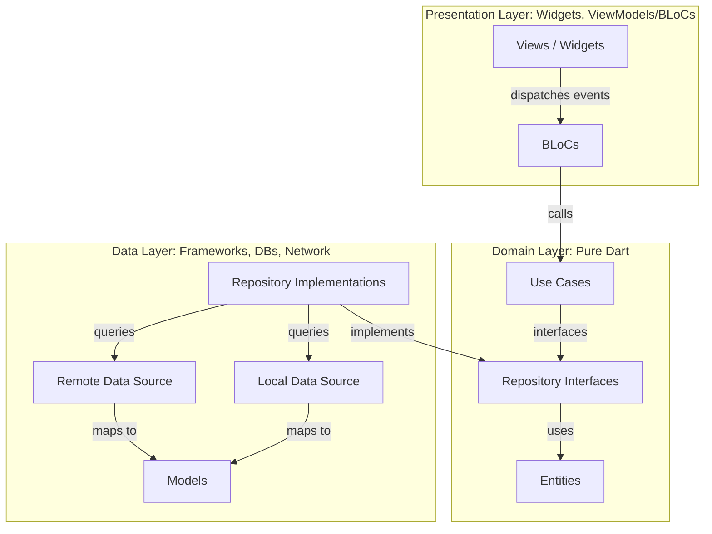

# Waseet (وسيط) - Ride & Package Sharing Platform

Waseet is a modern, premium mobile application built with Flutter that enables passengers to find, share, and book rides or package delivery trips. The app focuses on clean code, modular architecture, robust error handling, and separation of concerns.

## 🚀 Key Features

- **Authentication & Onboarding**: Email/password authentication, onboarding walkthrough, profile management, and session persistence.
- **Trip Management**: Driver trip creation, searching trips by city and date, booking rides, and updating available seat capacity in real time.
- **Favorites**: Mark specific trips as favorite and retrieve them in a dedicated favorites list.
- **Bookings**: Book trips, view active/past bookings, and automatically adjust seat capacity.
- **Themes & Localization**: English and Arabic support (via `easy_localization`) with full Dark/Light theme switching capability.

---

## 🏗️ Architecture & Design Principles

The project strictly adheres to **Clean Architecture** combined with **SOLID Principles** to ensure the codebase remains scalable, testable, and maintainable.



### 1. Presentation Layer (`lib/features/*/presentation`)
- **BLoCs**: Manage state transitions in response to user events (e.g., `AuthBloc`, `TripsBloc`, `BookingBloc`).
- **Views & Widgets**: Purely visual elements using standard Flutter styling and layout. Fully responsive across device formats.

### 2. Domain Layer (`lib/features/*/domain`)
- **Entities**: Pure business models that define the core data structure (e.g., `UserEntity`, `TripEntity`).
- **Use Cases**: Encapsulate unique business logic rules (e.g., `LoginUseCase`, `BookTripUseCase`).
- **Repository Interfaces**: Define the contracts for data operations without knowing anything about how data is retrieved.

### 3. Data Layer (`lib/features/*/data`)
- **Models**: Extend Domain Entities and implement JSON serialization/deserialization methods (e.g., `UserModel`, `TripModel`).
- **Data Sources**: Concrete implementations querying APIs/databases (e.g., `AuthRemoteDataSource` using Firebase, `AuthLocalDataSource` using Hive).
- **Repository Implementations**: Implement the domain repository interfaces. This is where remote/local data orchestration and UI-safe error handling take place.

---

## 📁 Directory Structure

```text
lib/
├── core/                         # Core components shared across features
│   ├── config/                   # Dependency injection setup (Injectable/GetIt)
│   ├── constants/                # App-wide constants (colors, assets, keys)
│   ├── error/                    # Failure and Exception classifications
│   ├── network/                  # Network client configurations
│   ├── services/                 # Firebase services, notifications, etc.
│   ├── theme/                    # Light & Dark theme settings and ThemeBloc
│   └── utils/                    # General helpers and extension methods
├── features/                     # Feature modules
│   ├── auth/                     # Authentication & onboarding flow
│   ├── bookings/                 # Passenger trip bookings
│   ├── favorites/                # Saved / Favorite trips
│   ├── home/                     # App shell and dashboard view
│   └── trips/                    # Trip search, creation, and details
├── widget/                       # Shared design system and reusable UI widgets
└── main.dart                     # Application entry point
```

---

## 🛠️ Getting Started

### Prerequisites
- [Flutter SDK](https://docs.flutter.dev/get-started/install) (v3.19.0 or higher recommended)
- [Dart SDK](https://dart.dev/get-started)
- Android Studio / VS Code
- Firebase Account & Configured project

### Installation Steps

1. **Clone the repository:**
   ```bash
   git clone <repository_url>
   cd waseet_project
   ```

2. **Get dependencies:**
   ```bash
   flutter pub get
   ```

3. **Configure Firebase:**
   Ensure the `lib/firebase_options.dart` file contains your current project's Firebase details, and register your Android/iOS app bundle identifiers with your Firebase Console.

4. **Run Code Generation (if using build_runner):**
   ```bash
   flutter pub run build_runner build --delete-conflicting-outputs
   ```

5. **Run the application:**
   ```bash
   flutter run
   ```

6. **Run tests:**
   ```bash
   flutter test
   ```

---

## 🧪 Testing Strategy

The project contains a comprehensive set of automated tests located in the `/test` and `/integration_test` directories:
- **Unit Tests**: Cover individual UseCases, BLoCs, and Entities.
- **Widget Tests**: Verify rendering, user interaction, and layout rules for shared UI components (e.g., `AuthTextField`, `AuthButton`).
- **Integration Tests** (under `/integration_test`): Validate end-to-end user flows in simulated environments (run with `flutter test integration_test/`).

---

## 📝 Design Standards & Code Quality

- **Linting rules**: Configured in `analysis_options.yaml` utilizing `package:flutter_lints/flutter.yaml`.
- **Error Handling**: Exception definitions (`exceptions.dart`) and corresponding Failures (`failures.dart`) are centralized. Catch blocks map raw infrastructure exceptions to domain failures using `handleException(e)`.
- **Clean Architecture Principles**: Business logic contains no dependencies on Flutter, Firebase, or external UI/database frameworks.
